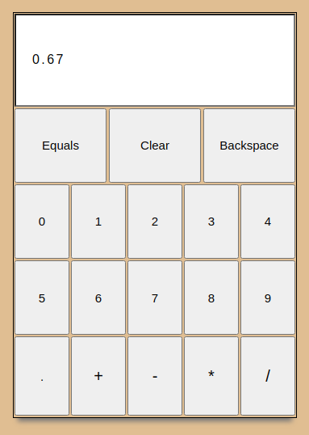

Calculator Project

A calculator capable of performing addition, subtraction, multiplication, and division functions.

Demo

Features

-Performs operations on two numbers at a time, incapable of using proper order of operations. 

-Input multiple operations and change input with backspace prior to acquiring calculation

How to use

-To use onine visit [this website](website)

Possible future additions

-Use of negative numbers

-Keyboard functionality

-Use of parenthesis and order of operations

Known Bugs

-If user divides by 0 in the middle of a long input, calculator will still perform all of the operations prior to the 0 division, and the resulting number might confuse user. Ideally division by zero should clear the display.  

Reflections

I'm happy with the fact that this project challenged me to be very thoughtful about pseudocode, and planning out logic prior to typing in code. While using reduce() for the main functionality of the calculations was educational in what it taught me about the method, I do think that it made the code less readable than I would like it to be. In the future I hope to put more thought into the naming of my variables, since the variables in reduce() make it difficult to understand the logic. The design came out better than I had expected, and I am satisfied with my decision of using flexbox over grid, since I think it fits the simplicity of the layout appropriately. 